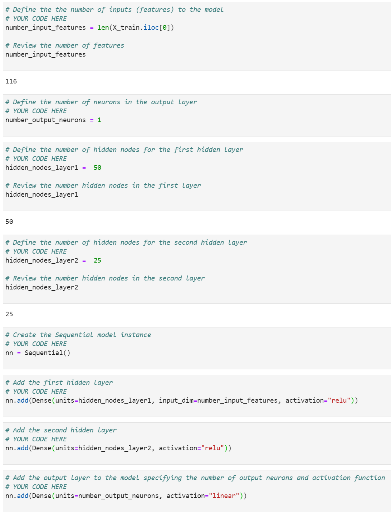
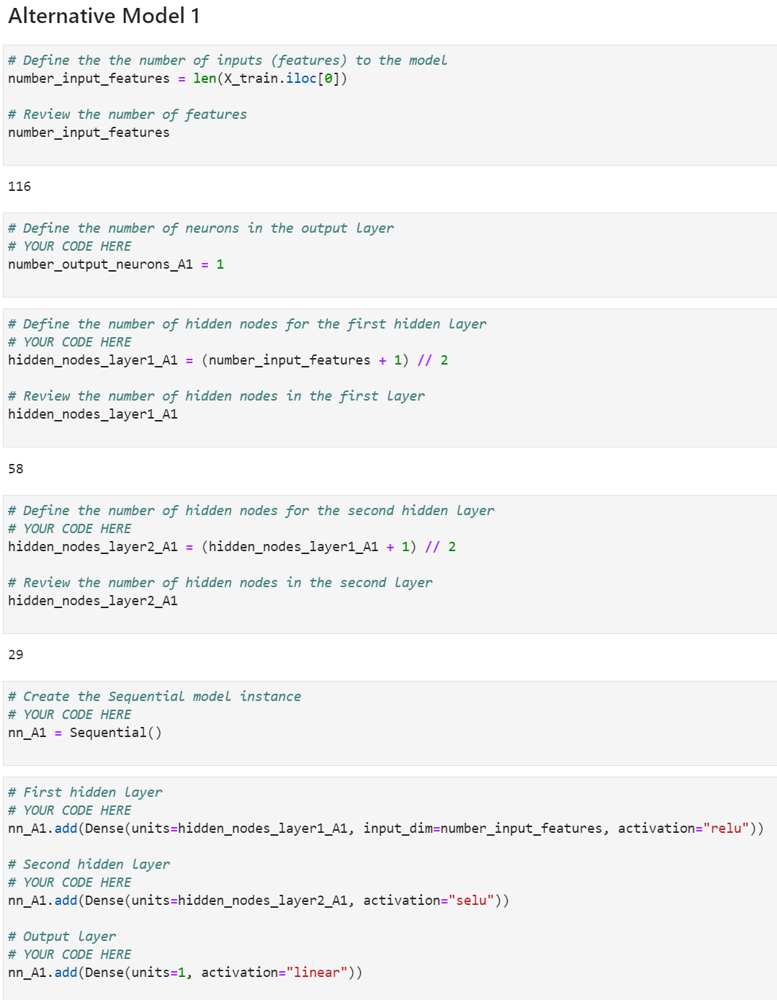
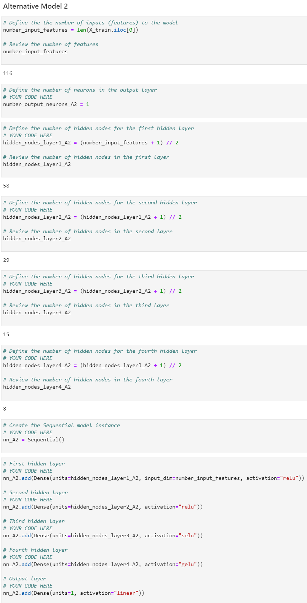
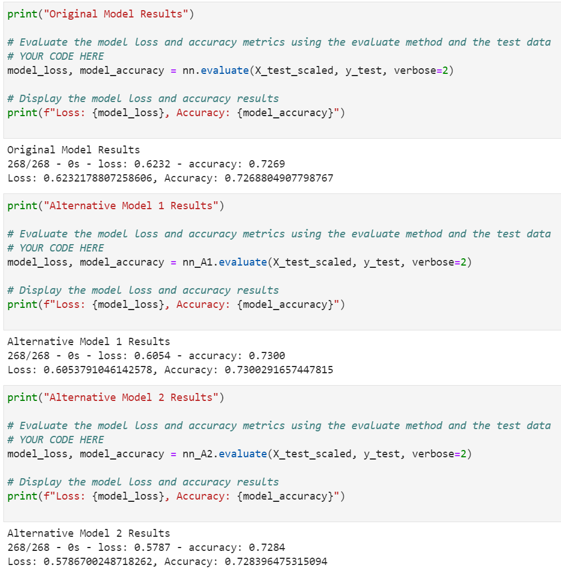

# Neural-Network-Alphabet

A Python based approach, using neural network model variations to determine the likelihood of success from loan applications.

Analysis begins with identification of object / categorical variables from the dataframe and encoding into seperate dataframe using OneHotEncoder.

Original dataframe numerical values are then concatinated to the OHE dataframe as preprocessing data.

Identifying our y variable as the likelihood of success for a loan application, and X as all other, we run an instance of train test split and fit the StandardScaler instance to the training data.

We then proceed to create a series of 3 binary classification models using neural network and some variations between each to identify loss and accuracy performance.

The analysis ends on a comparison of the metric report and, interpretting the results, we can determine which variant of the models performed the "best".

---

## Technologies

This analysis runs on python version 3.7, with the following add-ons:

* [tensorflow.keras](https://www.tensorflow.org/api_docs/python/tf/keras) - For creation of neural network and subroutines.

---

## Installation Guide

Before running the analysis, the following packages must be installed:

*    pip install --upgrade tensorflow

*    python -c "import tensorflow as tf;print(tf.keras.__version__)"

---

## Example

For a visual reference as to how the analysis was performed, please refer to the below:

---

## Contributors

Santiago Rosas
